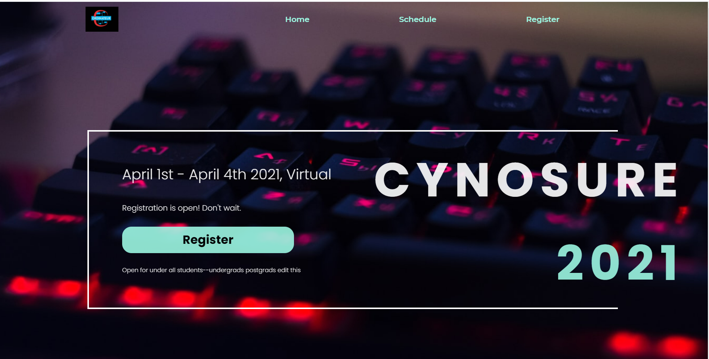
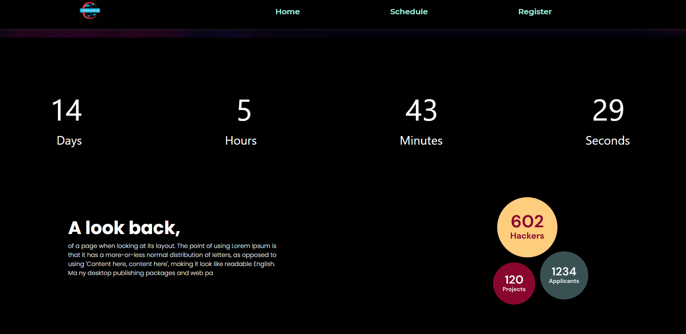
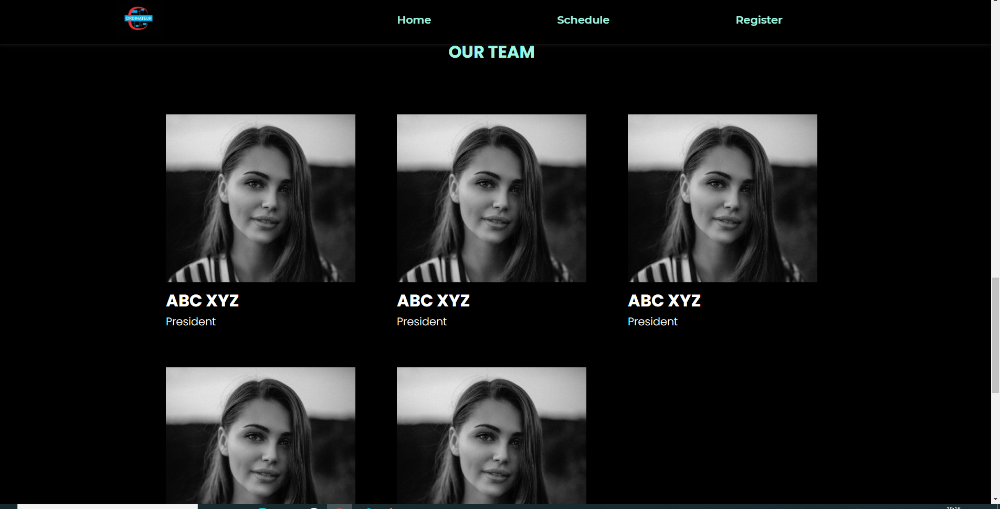
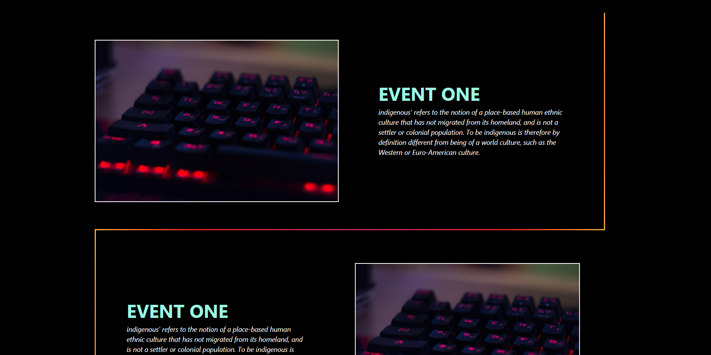
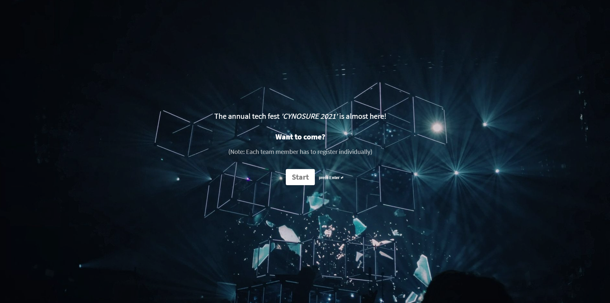

## Technical Fest Mock Template

<b>Built with</b> 

- This is a mock CSS template for a technical fest event.
- The template provides a visual representation of the event’s schedule.
- The template can be used to plan and organize the event’s layout and appearance

 

